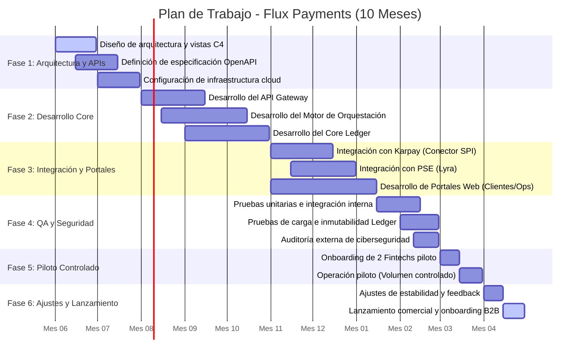

# 📅 Cronograma y Plan de Trabajo

El desarrollo de **Flux Payments** se proyecta a un término de **10 meses**, estructurado en 6 fases estratégicas que abarcan desde el diseño conceptual hasta el lanzamiento al mercado nacional.

---

## 📊 Diagrama de Gantt del Proyecto (Mermaid)

El siguiente diagrama representa el plan de trabajo interactivo del proyecto. Las tareas están organizadas cronológicamente por fases de desarrollo e integraciones críticas:

---

## 🗒️ Desglose de Entregables por Hito y Mes

| Fase | Período Temporal | Entregables Clave | Responsable Principal |
| :--- | :--- | :--- | :--- |
| **Fase 1: Diseño e Infraestructura** | **Mes 1 – Mes 2** | *   Modelado C4 aprobado (C1, C2, C3). *   Contratos API (OpenAPI 3.0 / Swagger JSON). *   Entornos de Sandbox AWS creados (IaC - Terraform). | Arquitecto de Software & DevOps |
| **Fase 2: Desarrollo Core** | **Mes 3 – Mes 5** | *   API Gateway desplegado con filtros de seguridad. *   Core Ledger registrando movimientos financieros. *   Motor de Orquestación manejando transacciones. | Backend Developers |
| **Fase 3: Integraciones** | **Mes 6 – Mes 7** | *   Conectores activos con Sandbox Karpay y Lyra. *   Portal de Clientes permitiendo visualización de transacciones. *   Checkout de prueba funcionando. | Backend & Frontend Developers |
| **Fase 4: QA y Seguridad** | **Mes 8** | *   Cobertura de código unitario > 85%. *   Reporte de Pentesting cerrado. *   Pruebas de latencia transaccional (< 2 segundos). | DevOps & Ingenieros de QA |
| **Fase 5: Onboarding & Piloto** | **Mes 9** | *   2 clientes reales procesando transacciones. *   Monitoreo operativo 24/7 activo. *   Comprobación del 80% de conciliación automática. | PM, DevOps & Operaciones |
| **Fase 6: Lanzamiento Comercial** | **Mes 10** | *   Pase a producción completo. *   Campaña comercial activa. *   Soporte B2B estructurado. | CEO, Ventas & Alianzas |

---

## ⚠️ Dependencias Críticas en el Cronograma

1.  **Conexión externa (Karpay):** El inicio de la Fase 3 depende directamente de la entrega de credenciales estables de Sandbox por parte de Karpay (SPI) en el Mes 6.
2.  **Seguridad (Fase 4):** Ningún cliente puede iniciar el piloto en el Mes 9 si la auditoría de seguridad del Mes 8 encuentra vulnerabilidades con severidad "Crítica" o "Alta".
3.  **Regulación Financiera:** El pase final a producción del Mes 10 está condicionado a la aprobación del marco legal contractual de corresponsalía digital.
