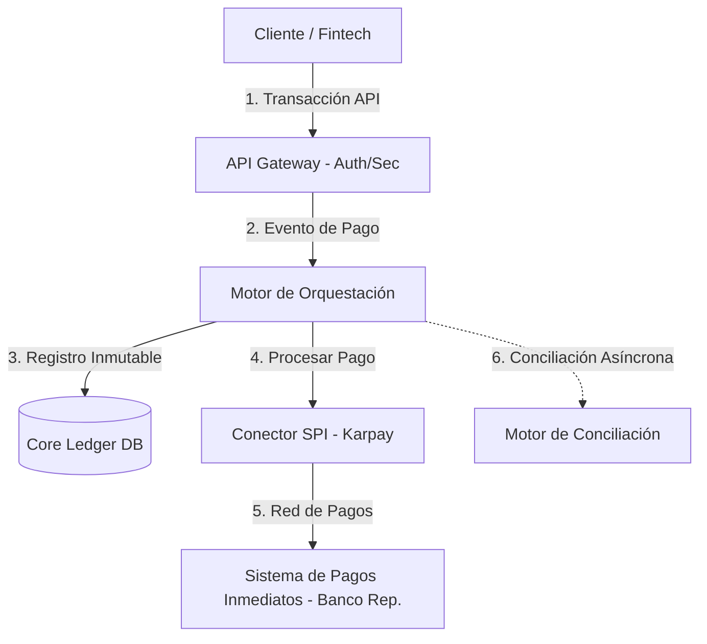

# ⚡ Flux Payments - Plataforma Fintech IaaS (Integración SPI)

Flux Payments es una plataforma intermediaria (Gateway) de infraestructura financiera bajo el modelo **Fintech Infrastructure-as-a-Service (IaaS)**. Su propósito es abstraer la complejidad técnica y operativa de la integración directa con el **Sistema de Pagos Inmediatos (SPI)** en Colombia, permitiendo que empresas (Fintechs, Marketplaces, ERPs) envíen y recauden pagos electrónicos 24/7 en tiempo real a través de una API unificada.

---

## 🗺️ Mapa de Artefactos y Documentación

Para facilitar la revisión y garantizar la máxima trazabilidad del proyecto de Arquitectura de Software Empresarial, la documentación se ha estructurado de forma rigurosa y ordenada. A continuación se presenta el índice interactivo de los componentes:

### 📂 [01. Gestión del Proyecto](./01-gestion-proyecto/)
Contiene la planeación estratégica, alcance, tiempos y organización del equipo:
*   📄 **[Project Charter (Acta de Constitución)](./01-gestion-proyecto/acta-constitucion.md):** Definición formal, patrocinio y roles de trabajo.
*   📄 **[Objetivos SMART](./01-gestion-proyecto/objetivos-smart.md):** Metas medibles de reducción de tiempos, automatización e impacto.
*   📄 **[Alcance del Proyecto](./01-gestion-proyecto/alcance.md):** Límites del sistema, inclusiones detalladas y exclusiones.
*   📄 **[Cronograma del Proyecto](./01-gestion-proyecto/cronograma.md):** Planificación temporal detallada a 10 meses en formato Gantt.
*   📄 **[Matriz de Interesados](./01-gestion-proyecto/stakeholders.md):** Identificación, clasificación (Poder/Interés) y plan de comunicación.
*   📄 **[Plan de Gestión del Proyecto](./01-gestion-proyecto/plan-gestion.md):** Metodología de control, gestión de cambios y comunicación.

### 📂 [02. Requerimientos](./02-requerimientos/)
Define el comportamiento funcional, los límites del sistema y la experiencia de usuario:
*   📄 **[Requerimientos Funcionales](./02-requerimientos/requerimientos-funcionales.md):** Catálogo formal de RFs con ID, prioridad y criterios de aceptación (Gherkin BDD).
*   📄 **[Requerimientos No Funcionales](./02-requerimientos/requerimientos-no-funcionales.md):** Clasificación según ISO 25010 (Seguridad, Alta Disponibilidad, Rendimiento, Confiabilidad).
*   📄 **[Casos de Uso del Sistema](./02-requerimientos/casos-de-uso.md):** Escenarios detallados (Flujo principal, alternativo, pre y postcondiciones) para el núcleo transaccional.
*   📄 **[Historias de Usuario](./02-requerimientos/historias-usuario.md):** Historias ágiles estructuradas con criterios de aceptación técnicos.

### 📂 [03. Arquitectura](./03-arquitectura/)
Representa las vistas de diseño técnico mediante el estándar C4 y flujos de procesos:
*   📄 **[Diagrama de Flujo AS-IS](./03-arquitectura/diagrama-flujo-as-is.md):** Representación del flujo actual lento, manual e integrado individualmente con bancos.
*   📄 **[Diagrama de Flujo TO-BE](./03-arquitectura/diagrama-flujo-to-be.md):** El nuevo proceso simplificado, ágil y automatizado mediante Flux.
*   📄 **[Contexto C1 (Nivel 1)](./03-arquitectura/contexto-c1.md):** Frontera del sistema con clientes, proveedores de red y bancos.
*   📄 **[Contenedores C2 (Nivel 2)](./03-arquitectura/contenedores-c2.md):** Estructura tecnológica (Portales, API Gateway, Microservicios, Core Ledger, adaptadores).
*   📄 **[Componentes C3 (Nivel 3)](./03-arquitectura/componentes-c3.md):** Desglose del motor de orquestación interna para procesar transacciones SPI.
*   📄 **[Registro de Decisiones de Arquitectura (ADRs)](./03-arquitectura/decisiones-diseno.md):** Justificación formal de elecciones tecnológicas y patrones.

### 📂 [04. Gestión de Riesgos](./04-riesgos/)
Identifica posibles contingencias del proyecto y la operación:
*   📄 **[Matriz de Riesgos](./04-riesgos/matriz-riesgos.md):** Cuadrante de probabilidad e impacto para riesgos técnicos, operativos y regulatorios.
*   📄 **[Registro de Riesgos](./04-riesgos/registro-riesgos.md):** Plan de acción activo, mitigaciones e indicadores de contingencia.

### 📂 [05. Calidad (QA)](./05-calidad/)
Asegura que el producto final cumpla con las especificaciones y niveles de servicio:
*   📄 **[Plan de Calidad](./05-calidad/plan-calidad.md):** Estrategia de testing unitario, de integración, rendimiento y seguridad.
*   📄 **[Criterios de Aceptación del Sistema](./05-calidad/criterios-aceptacion.md):** Niveles de servicio y métricas requeridas para el paso a producción.
*   📄 **[Lista de Verificación de Artefactos](./05-calidad/lista-verificacion.md):** Checklist de control de calidad sobre la documentación del proyecto.

### 📂 [06. Presentación Final](./presentacion/)
*   📄 **[Diapositivas y Guión de Sustentación](./presentacion/presentacion.md):** Guión técnico y estructurado listo para la presentación y defensa del proyecto ante el docente.

---

## 🛠️ Arquitectura Conceptual y Flujo Transaccional

A nivel general, el sistema implementa una arquitectura orientada a eventos para el procesamiento en tiempo real:

## 📅 Hitos del Proyecto
*   **Fecha de Entrega:** 28 de Mayo de 2026.
*   **Alcance:** Modelado técnico de arquitectura empresarial para la integración transaccional SPI 24/7.